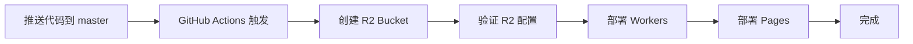

# GitHub Actions 自动部署配置检查清单

## ✅ 已完成的配置

### 1. GitHub Actions 工作流文件
- ✅ `.github/workflows/deploy.yml` 已更新
- ✅ 添加了 R2 存储桶自动创建步骤
- ✅ 添加了 R2 配置验证步骤
- ✅ 使用正确的 Secrets 变量名

### 2. 后端配置
- ✅ `backend-workers/wrangler.toml` 已配置 R2 绑定
- ✅ `backend-workers/src/utils/r2-monitor.js` 额度监控已实现
- ✅ `backend-workers/src/routes/storage.js` 存储管理 API 已创建
- ✅ 文档和开题报告路由已集成额度检查

### 3. 前端配置
- ✅ `frontend/src/api/storage.js` API 调用已创建
- ✅ `frontend/src/views/Documents.vue` 存储统计展示已完成
- ✅ `frontend/src/views/Proposals.vue` 存储统计展示已完成

---

## 📋 你需要手动完成的步骤

### 步骤 1：获取 Cloudflare 凭证（5 分钟）

#### 1.1 获取 API Token
1. 访问 [https://dash.cloudflare.com/profile/api-tokens](https://dash.cloudflare.com/profile/api-tokens)
2. 点击 **Create Token**
3. 选择 **Edit Cloudflare Workers** 模板
4. 确保包含以下权限：
   - ✅ Workers Scripts: Edit
   - ✅ R2 Storage: Edit
   - ✅ Pages: Edit
   - ✅ D1: Edit
5. 点击 **Create Token**
6. **复制 Token**（只显示一次！）

#### 1.2 获取 Account ID
1. 访问 [https://dash.cloudflare.com](https://dash.cloudflare.com)
2. 在右侧栏找到你的账户
3. 复制 **Account ID**

或者运行：
```bash
npx wrangler whoami
```

---

### 步骤 2：配置 GitHub Secrets（2 分钟）

#### 2.1 进入仓库设置
访问：`https://github.com/xiangnuan1234/graduation-management/settings/secrets/actions`

#### 2.2 添加两个 Secrets

**Secret 1:**
- Name: `CLOUDFLARE_API_TOKEN`
- Value: 粘贴你的 API Token

**Secret 2:**
- Name: `CLOUDFLARE_ACCOUNT_ID`
- Value: 粘贴你的 Account ID

---

### 步骤 3：推送代码触发部署（1 分钟）

```bash
# 1. 添加所有更改
git add .

# 2. 提交更改
git commit -m "feat: 添加 R2 文件上传功能和 GitHub Actions 自动部署配置

- 实现 R2 额度监控和自动停止机制
- 添加存储空间可视化展示
- 配置 GitHub Actions 自动创建 R2 存储桶
- 更新部署工作流使用正确的 Secrets"

# 3. 推送到主分支
git push origin master
```

---

### 步骤 4：验证部署（5 分钟）

#### 4.1 查看 GitHub Actions 状态
访问：`https://github.com/xiangnuan1234/graduation-management/actions`

应该看到：
- ✅ deploy-workers 工作流正在运行或已完成
- ✅ deploy-pages 工作流正在运行或已完成

#### 4.2 检查关键步骤日志

点击工作流查看详情，确认以下步骤成功：

**deploy-workers:**
1. ✅ Setup Node.js
2. ✅ Install Dependencies
3. ✅ Create R2 Bucket (if not exists) - 可能显示警告，这是正常的
4. ✅ Verify R2 Configuration - 应该显示 "✓ R2 configuration found"
5. ✅ Deploy to Cloudflare Workers

**deploy-pages:**
1. ✅ Setup Node.js
2. ✅ Install Dependencies
3. ✅ Build Frontend
4. ✅ Deploy to Cloudflare Pages

#### 4.3 验证 R2 存储桶
访问：[https://dash.cloudflare.com/?to=/:account/r2](https://dash.cloudflare.com/?to=/:account/r2)

应该能看到 `graduation-files` 存储桶

#### 4.4 测试前端功能
1. 访问你的前端应用
2. 登录学生账号
3. 进入"文档管理"页面
4. 应该能看到存储空间使用情况卡片
5. 尝试上传一个小文件（< 5MB）测试

---

## 🔍 故障排除

### 问题 1：GitHub Actions 失败 - Secret 未找到

**错误信息：**
```
Error: Input required and not supplied: CLOUDFLARE_API_TOKEN
```

**解决：**
1. 确认已在 GitHub Settings → Secrets 中添加了两个 Secrets
2. 名称必须完全匹配：`CLOUDFLARE_API_TOKEN` 和 `CLOUDFLARE_ACCOUNT_ID`
3. 注意大小写！

---

### 问题 2：R2 Bucket 创建失败

**错误信息：**
```
Error: Bucket already exists
```

**解决：**
这是**正常的**！工作流配置了 `continue-on-error: true`，会忽略这个错误。
Bucket 已经存在，无需再次创建。

---

### 问题 3：Workers 部署失败 - 权限不足

**错误信息：**
```
Error: Permission denied
```

**解决：**
1. 检查 API Token 是否包含 Workers Scripts: Edit 权限
2. 重新创建 Token 并更新 GitHub Secret
3. 确保使用的是正确的 Account ID

---

### 问题 4：前端无法访问存储统计 API

**现象：**
前端显示"无法获取存储统计信息"

**解决：**
1. 检查浏览器控制台的网络请求
2. 确认 Workers 已成功部署
3. 访问 `/api/storage/usage` 直接测试 API
4. 检查 CORS 配置是否正确

---

### 问题 5：上传文件失败

**错误信息：**
```
R2 存储未配置
```

**解决：**
1. 确认 `wrangler.toml` 中包含 R2 配置
2. 确认 R2 bucket 已创建
3. 重新部署 Workers
4. 检查 Workers 日志

---

## 📊 部署成功后预期结果

### 1. R2 存储桶
- ✅ 名称：`graduation-files`
- ✅ 位置：Cloudflare Dashboard 可见
- ✅ 状态：活跃

### 2. Workers API
- ✅ 端点：`https://graduation-management-api.xiangnuan.workers.dev`（或你的自定义域名）
- ✅ `/api/storage/usage` 返回存储统计
- ✅ `/api/documents` 支持文件上传
- ✅ `/api/proposals` 支持文件上传

### 3. 前端页面
- ✅ 文档管理页面显示存储使用进度条
- ✅ 开题报告页面显示存储使用进度条
- ✅ 可以上传文件（使用率 < 95% 时）
- ✅ 超过 95% 时自动禁止上传

### 4. 额度保护
- ✅ 实时监控 R2 使用量
- ✅ 70% 显示注意提示
- ✅ 85% 显示警告提示
- ✅ 95% 自动停止上传

---

## 🎯 快速验证命令

部署完成后，运行以下命令验证：

```bash
# 1. 测试存储统计 API
curl https://你的域名/api/storage/usage

# 预期响应：
{
  "code": 200,
  "data": {
    "enabled": true,
    "storage": {
      "used": 0,
      "usedFormatted": "0 B",
      "limit": 10737418240,
      "limitFormatted": "10 GB",
      "usagePercent": "0.00"
    },
    ...
  }
}

# 2. 检查 R2 Bucket
npx wrangler r2 bucket list

# 应该看到 graduation-files

# 3. 查看 Workers 部署状态
npx wrangler deploy --dry-run
```

---

## 📝 总结

### 自动化流程



### 你只需要做 3 件事：

1. ⏱️ **5 分钟** - 获取 Cloudflare API Token 和 Account ID
2. ⏱️ **2 分钟** - 在 GitHub 配置两个 Secrets
3. ⏱️ **1 分钟** - 推送代码触发自动部署

**总计：约 8 分钟完成所有配置！**

---

## 🆘 需要帮助？

如果遇到问题：

1. 📖 查看详细文档：
   - [GITHUB_SECRETS_SETUP.md](./GITHUB_SECRETS_SETUP.md)
   - [R2_SETUP.md](./R2_SETUP.md)
   - [README_R2.md](./README_R2.md)

2. 🔍 检查日志：
   - GitHub Actions 日志
   - Cloudflare Workers 日志
   - 浏览器控制台

3. 💬 参考官方文档：
   - [Cloudflare Workers CI/CD](https://developers.cloudflare.com/workers/ci-cd/)
   - [GitHub Actions](https://docs.github.com/en/actions)

---

**准备好了吗？开始配置吧！** 🚀
